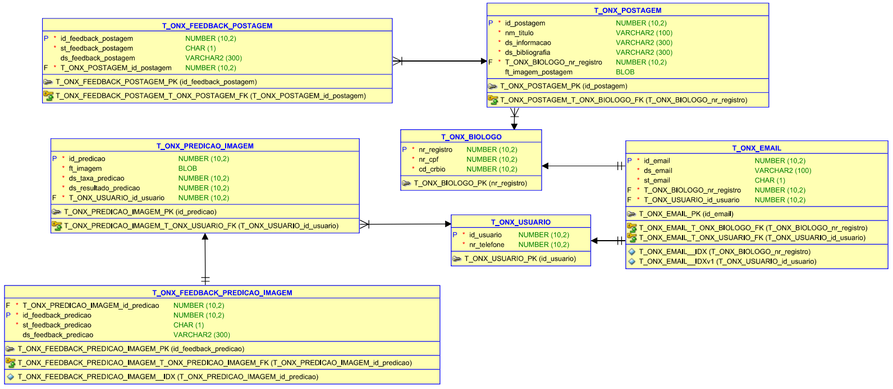

<div align="center">
    <h2>⚜️ O c e a n N e x ⚜️</h2>
</div>

<p align="center">
    <a href="#-projeto">Projeto</a>&nbsp;&nbsp;&nbsp;|&nbsp;&nbsp;&nbsp;
    <a href="#-tecnologias">Tecnologias</a>&nbsp;&nbsp;&nbsp;|&nbsp;&nbsp;&nbsp;
    <a href="#-funcionalidades">Funcionalidades</a>&nbsp;&nbsp;&nbsp;|&nbsp;&nbsp;&nbsp;
    <a href="#-diagramas">Diagramas</a>
</p>

<p align="center"> <a href="">Vídeo de apresentação do projeto</a></p>

<h3>Integrantes</h3>

- Matheus O.A.C Silva - RM 98502
- Amorgan M. Lopes - RM 98552
- Guilherme C. de Matos - RM 98874
- Gustavo G. da Silva - RM 99585
- Erick K. da Silva - RM 550371

--------------------------------------------------
<h3>Como Rodar a Aplicação </h3>

<h4>Pré-requisitos</h4> 

- [Java Development Kit (JDK)](https://www.oracle.com/java/technologies/downloads/#java11) instalado em seu sistema.
- [Visual Studio Code (VSCode)](https://code.visualstudio.com) instalado em seu sistema.

<h4>Passos para Executar a Aplicação</h4> 

- Clonar o Repositório:
```bash
git clone https://github.com/guicarm/OceanNex
```

--------------------------------------------------

## 📚 Projeto 

<p>Bem-vindo ao OceanNex. O projeto consiste no desenvolvimento de uma plataforma online para aprimorar pesquisas relacionadas a microalgas em geral, tendo como seu maior diferencial um mecanismo de Machine Learning capaz de reconhecer diversos tipos de algas, aperfeiçoando pesquisas já existentes e permitindo uma melhor conscientização geral em relação a questão da biologia aquática.</p>
<p>O público-alvo do projeto OceanNex são biólogos e pesquisadores que queiram aperfeiçoar ou começar pesquisas sobre biologia aquática.</p>

<br/>

## 🖥 Tecnologias

- [Spring](https://spring.io)
- [Insomnia](https://insomnia.rest/download)
- [Data Modeler](https://www.oracle.com/database/sqldeveloper/technologies/sql-data-modeler/download/)

<br/>

## 🧾 Funcionalidades

- [x] Sistema de login/cadastro totalmente funcional.
- [x] Lidar com o tipo de usuário (biólogo/usuário comum).
- [x] CRUD de usuários.
- [x] CRUD de postagens.
- [x] CRUD de predições realizadas.
- [x] CRUD de feedbacks das predições.
- [x] CRUD de feedbacks das postagens.
      
<br/>

## 📈 Diagramas

<div>
    
</div>
<br/>
<div>
    
</div>


<br/>

## 🌐 [Arquivo JSON Insomnia](./documents/Insomnia_2024-06-04.json) 🌐

<br/>

## 📃 Documentação da API

<h3> Endpoints de documentação </h3>

- [Link para o Banco de dados H2](localhost:8080/db):
```
localhost:8080/db
```

- [Link para a documentação Swagger do projeto](localhost:8080/docs):
```
localhost:8080/docs
```

